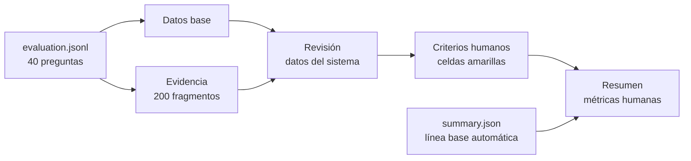

# Revisión manual de las 40 respuestas RAG

## 1. Objetivo de esta etapa

La evaluación automática ya permite medir si el sistema:

- recuperó al menos una fuente `gold`;
- citó al menos una fuente `gold`;
- decidió responder o abstenerse según lo esperado;
- produjo una salida que cumple el contrato estructural;
- tardó cierto tiempo en recuperar y generar.

Sin embargo, esas comprobaciones no demuestran que el contenido de la respuesta
sea correcto. Un sistema puede citar el artículo esperado y aun así interpretar
mal una condición, omitir una excepción o agregar una afirmación que no aparece
en la fuente. Por eso la siguiente capa de evaluación es una revisión humana.

Esta etapa busca responder preguntas diferentes:

1. ¿La respuesta es factualmente correcta?
2. ¿Cubre todas las partes importantes de la pregunta?
3. ¿Cada afirmación está respaldada por las fuentes citadas?
4. ¿La respuesta es clara y directa?
5. ¿La evidencia `gold` definida manualmente era adecuada?
6. ¿La respuesta completa debe aprobarse, revisarse o rechazarse?

## 2. Artefacto creado

Se creó el libro:

```text
outputs/rag-manual-review-20260728/revision_manual_rag.xlsx
```

El libro fue generado a partir de la corrida seleccionada:

```text
results/rag-evaluation/2026-07-28/
qwen3.5-9b-normalized-citations/evaluation.jsonl
```

También usa las métricas agregadas de:

```text
results/rag-evaluation/2026-07-28/
qwen3.5-9b-normalized-citations/summary.json
```

La construcción importó:

- 40 registros de evaluación, uno por pregunta;
- 200 fragmentos recuperados, cinco por pregunta;
- las respuestas esperadas;
- las respuestas generadas o, si ocurrió un error, la salida bruta;
- los identificadores de fuentes recuperadas, citadas y `gold`;
- las latencias y los resultados automáticos.

El archivo se revisó después de exportarlo. Contiene seis hojas, seis reglas de
listas desplegables y 594 celdas con fórmulas. La búsqueda de errores de fórmula
no encontró `#REF!`, `#DIV/0!`, `#VALUE!`, `#NAME?` ni `#N/A`.

## 3. Flujo de información



La separación es deliberada. Los resultados originales se conservan en hojas
de consulta y la persona revisora escribe solamente en la zona amarilla de
`Revisión`. Así se evita mezclar accidentalmente el resultado del sistema con
el juicio humano.

## 4. Qué contiene cada hoja

### 4.1. Guía

Es la primera hoja y funciona como referencia rápida. Resume:

- el orden recomendado de trabajo;
- los cinco criterios de la rúbrica;
- los valores posibles;
- las reglas para la conclusión manual;
- la definición de `gold` y `Source ID`;
- la procedencia de los datos;
- la advertencia de consultar siempre la fuente oficial.

### 4.2. Resumen

Es un tablero calculado mediante fórmulas. No se llena manualmente, salvo que se
quiera cambiar el peso asignado a una respuesta parcialmente correcta.

Muestra:

- número de preguntas;
- revisiones completas y pendientes;
- porcentaje de avance;
- conclusiones aprobadas, para revisar, rechazadas o no aplicables;
- respuestas correctas, parciales, incorrectas o no aplicables;
- tasa estricta de corrección;
- puntaje factual ponderado;
- fidelidad total a las fuentes;
- cobertura completa;
- desglose por tipo de pregunta;
- línea base automática antes de la revisión humana.

El peso de una respuesta `Parcial` está en `Resumen!B12` y comienza en `0.50`.
Eso significa que el puntaje ponderado trata dos respuestas parciales como el
equivalente de una respuesta correcta. El valor queda visible para que la
decisión metodológica no esté escondida dentro de una fórmula.

Las métricas humanas no representan un resultado final mientras existan filas
pendientes.

### 4.3. Revisión

Es la hoja principal. Tiene una fila por pregunta.

Las columnas grises contienen datos del sistema y no deben editarse:

- identificador, tipo y categoría;
- pregunta;
- respuesta esperada;
- estado del sistema;
- respuesta generada o salida bruta;
- citas;
- `Record IDs` citados y esperados;
- resultados automáticos de recuperación y cita;
- prioridad de revisión.

Las columnas amarillas son las entradas humanas:

1. `Corrección factual`;
2. `Cobertura`;
3. `Fidelidad a fuentes`;
4. `Claridad`;
5. `Gold adecuado`;
6. `Conclusión manual`;
7. `Notas`;
8. `Revisor`;
9. `Fecha revisión`.

La columna `Revisión completa` se calcula automáticamente. Solo cambia a `Sí`
cuando los seis criterios tienen un valor y también se ingresaron revisor y
fecha. Las notas son opcionales, aunque son muy recomendables en respuestas
parciales, rechazadas, dudosas o con errores estructurales.

### 4.4. Datos base

Conserva una representación tabular del `evaluation.jsonl`. Incluye tanto el
contenido como las métricas técnicas:

- respuesta esperada y resultado generado;
- decisión automática;
- errores estructurales;
- tiempo de recuperación;
- tiempo de generación;
- tiempo total;
- velocidad de generación;
- identificador de la corrida.

Esta hoja existe para trazabilidad. No es la hoja de evaluación humana y no debe
modificarse.

### 4.5. Evidencia

Contiene 200 filas: cinco fragmentos recuperados para cada una de las 40
preguntas.

Para cada fragmento muestra:

- `Question ID`;
- `Source ID`, de `F1` a `F5`;
- posición o `rank`;
- similitud semántica;
- `Record ID`;
- si era evidencia `gold`;
- si fue citado por el modelo;
- etiqueta de la cita;
- URL oficial;
- texto recuperado;
- identificador del fragmento y del documento.

Esta hoja permite verificar la respuesta contra el texto que realmente recibió
el modelo, no contra una suposición acerca de lo que pudo haber visto.

### 4.6. Catálogos

Contiene los valores permitidos por las listas desplegables de `Revisión`. No se
debe cambiar durante una misma evaluación porque eso alteraría la rúbrica entre
preguntas.

## 5. Cómo abrir el libro

Desde PowerShell, en la raíz del repositorio:

```powershell
Start-Process ".\outputs\rag-manual-review-20260728\revision_manual_rag.xlsx"
```

El comando pide a Windows abrir el libro con la aplicación predeterminada para
archivos `.xlsx`, normalmente Microsoft Excel.

Para conservar una plantilla vacía y trabajar en una copia:

```powershell
Copy-Item `
  ".\outputs\rag-manual-review-20260728\revision_manual_rag.xlsx" `
  ".\outputs\rag-manual-review-20260728\revision_manual_rag_completada.xlsx"
```

Después se abre la copia:

```powershell
Start-Process `
  ".\outputs\rag-manual-review-20260728\revision_manual_rag_completada.xlsx"
```

La copia es recomendable porque permite distinguir con claridad:

- la plantilla generada automáticamente;
- la revisión humana completada;
- cualquier revisión posterior hecha con otra rúbrica o por otra persona.

## 6. Orden recomendado para revisar

### Paso 1. Abrir `Revisión`

La tabla tiene filtros en los encabezados. El primer filtro útil es
`Prioridad`.

La prioridad no reemplaza el juicio humano. Solo ayuda a decidir por dónde
empezar:

- `Error estructural`: el modelo produjo una salida que no pasó el contrato;
- `Decisión incorrecta`: respondió cuando debía abstenerse o se abstuvo cuando
  debía responder;
- `Cita no gold`: respondió, pero no citó la evidencia esperada;
- `Revisión normal`: no apareció ninguna de las señales anteriores.

### Paso 2. Leer tres textos

Para cada fila se deben leer:

1. la pregunta;
2. la respuesta esperada;
3. la respuesta generada o bruta.

La respuesta esperada es una referencia de evaluación, no un texto que el
modelo deba copiar palabra por palabra.

### Paso 3. Verificar la evidencia

Se copia el `Question ID`, se abre `Evidencia` y se filtra esa columna. Deben
quedar cinco filas.

Luego se comprueba:

- cuáles fragmentos están marcados como `Esperada gold = Sí`;
- cuáles están marcados como `Citada por modelo = Sí`;
- si las afirmaciones de la respuesta aparecen realmente en esos fragmentos;
- si una fuente distinta de la `gold` también respalda correctamente la
  respuesta;
- si la URL apunta a una página oficial del TEC.

### Paso 4. Completar la rúbrica

Se llenan los seis desplegables amarillos. Después se agrega:

- una nota cuando sea necesaria;
- el nombre o identificador de la persona revisora;
- la fecha.

### Paso 5. Confirmar la fila

La última columna debe cambiar de `No` a `Sí`. Si sigue en `No`, falta por
completar al menos un criterio, el revisor o la fecha.

### Paso 6. Revisar el resumen

Cuando las 40 filas estén completas se abre `Resumen`. En ese momento las
métricas humanas pueden utilizarse en el análisis del proyecto y en el póster.

## 7. Definición exacta de la rúbrica

### 7.1. Corrección factual

Pregunta de control:

> ¿Las afirmaciones de la respuesta son verdaderas según la evidencia oficial?

- `Correcta`: todas las afirmaciones relevantes son verdaderas.
- `Parcial`: la idea principal es correcta, pero existe un error menor,
  imprecisión o condición mal expresada.
- `Incorrecta`: la conclusión principal es falsa o contiene un error que podría
  cambiar la decisión de la persona usuaria.
- `No aplica`: no existe contenido factual que evaluar, por ejemplo en una
  abstención correcta.

No se debe marcar `Correcta` únicamente porque la respuesta tenga una cita.

### 7.2. Cobertura

Pregunta de control:

> ¿La respuesta atendió todas las partes relevantes de la pregunta?

- `Completa`: responde todos los componentes solicitados.
- `Parcial`: responde la parte principal, pero omite una condición, excepción o
  segundo componente.
- `Insuficiente`: no responde lo esencial o presenta una abstención incorrecta.
- `No aplica`: la pregunta era deliberadamente imposible y la abstención fue
  correcta.

### 7.3. Fidelidad a fuentes

Pregunta de control:

> ¿Las afirmaciones están sustentadas por las fuentes que el modelo citó?

- `Total`: cada afirmación importante puede justificarse con las fuentes
  citadas.
- `Parcial`: la fuente sustenta la idea principal, pero no todos los detalles.
- `No respaldada`: la cita no contiene el dato afirmado o la respuesta agrega
  información ajena al contexto.
- `No aplica`: no hubo una respuesta factual, como en una abstención correcta.

La fidelidad se evalúa contra las fuentes citadas por el modelo. La corrección
factual puede consultar además las otras fuentes oficiales recuperadas.

### 7.4. Claridad

Pregunta de control:

> ¿La respuesta es comprensible, directa y no induce a una interpretación
> ambigua?

- `Clara`: comunica la respuesta sin dificultad.
- `Mejorable`: se entiende, pero es repetitiva, demasiado extensa o poco
  precisa.
- `Confusa`: la redacción dificulta comprender la conclusión.
- `No aplica`: no existe texto interpretable debido a una falla total.

### 7.5. Gold adecuado

Pregunta de control:

> ¿La evidencia manual definida para esta pregunta era suficiente y apropiada?

- `Sí`: los `Record IDs gold` contienen la evidencia necesaria.
- `No`: la referencia esperada es incorrecta o insuficiente.
- `Dudosa`: hace falta revisar el documento oficial o hay más de una
  interpretación razonable.
- `No aplica`: no puede evaluarse la calidad del `gold` en ese caso.

`Gold` significa evidencia esperada seleccionada manualmente. No significa que
sea la única fuente válida. Si otro artículo oficial responde correctamente, se
debe registrar en `Notas` y evaluar la respuesta con criterio, no rechazarla de
forma automática.

### 7.6. Conclusión manual

- `Aprobada`: la respuesta es correcta, suficientemente completa y fiel.
- `Revisar`: contiene valor, pero es parcial, ambigua o depende de comprobar el
  `gold`.
- `Rechazada`: es incorrecta, no está respaldada o el sistema no entregó una
  salida utilizable.
- `No aplica`: se reserva para un caso que no deba formar parte de la conclusión
  de calidad.

La conclusión resume el juicio, pero no sustituye los otros cinco criterios.

## 8. Casos especiales

### 8.1. Abstención correcta

Una pregunta `unanswerable` está diseñada para no tener respuesta en el corpus.
Si el sistema devuelve `not_found` correctamente, una asignación coherente es:

- corrección factual: `No aplica`;
- cobertura: `No aplica`;
- fidelidad: `No aplica`;
- claridad: `Clara`, `Mejorable` o `Confusa`;
- gold adecuado: `Sí`;
- conclusión: `Aprobada`.

La aprobación significa que el sistema se negó correctamente a inventar una
respuesta.

### 8.2. Abstención incorrecta

Si la pregunta sí era respondible, pero el sistema devuelve `not_found`:

- corrección factual: `Incorrecta`;
- cobertura: `Insuficiente`;
- fidelidad: `No aplica`;
- claridad: se evalúa según el mensaje;
- gold adecuado: se revisa normalmente;
- conclusión: normalmente `Rechazada`.

### 8.3. Error estructural

Un error estructural significa que la salida no cumplió el contrato esperado,
por ejemplo porque las citas visibles no coincidieron con el campo estructurado.

La columna de respuesta muestra la salida bruta para que todavía se pueda
evaluar su contenido:

- la corrección factual se califica según el texto bruto;
- la fidelidad se comprueba contra las citas y la evidencia;
- la conclusión puede ser `Rechazada` aunque el contenido sea correcto, porque
  el pipeline no entregó una salida válida;
- la nota debe indicar que el rechazo se debe al protocolo y no necesariamente
  al contenido.

Esto separa dos preguntas útiles: “¿sabía la respuesta?” y “¿el sistema pudo
entregarla de forma confiable?”.

### 8.4. Fuente alternativa válida

Si el modelo usa un artículo oficial diferente del `gold`, pero ese artículo
respalda la respuesta:

1. no se rechaza automáticamente;
2. se marca `Gold adecuado` como `Dudosa` o `No`, según el caso;
3. se registra el `Record ID` alternativo en `Notas`;
4. se considera corregir el conjunto de evaluación en una versión futura.

No se debe modificar la corrida histórica ni sobrescribir el `evaluation.jsonl`.

## 9. Preguntas que conviene revisar primero

La evaluación automática detectó seis casos prioritarios:

| Pregunta | Señal automática | Motivo |
|---|---|---|
| `q016` | Decisión incorrecta | Era respondible y el sistema se abstuvo; tampoco recuperó la fuente `gold`. |
| `q017` | Cita no gold | Respondió, pero no recuperó ni citó la evidencia esperada. |
| `q025` | Error estructural | Las citas del texto y del campo estructurado no coincidieron. |
| `q028` | Error estructural | Las citas del texto y del campo estructurado no coincidieron. |
| `q029` | Decisión incorrecta | Recuperó evidencia, pero se abstuvo en una pregunta respondible. |
| `q032` | Error estructural | Las citas del texto y del campo estructurado no coincidieron. |

Revisar primero estos casos ayuda a entender los fallos, pero las 40 preguntas
deben evaluarse para obtener métricas humanas sin sesgo de selección.

## 10. Cómo interpretar las métricas finales

### Tasa estricta de respuestas correctas

```text
Correctas / (Correctas + Parciales + Incorrectas)
```

`No aplica` se excluye del denominador.

### Puntaje factual ponderado

Con el peso inicial de `0.50`:

```text
(Correctas + 0.50 × Parciales)
/
(Correctas + Parciales + Incorrectas)
```

La tasa estricta es más exigente. El puntaje ponderado reconoce que una
respuesta parcial puede contener información útil.

### Fidelidad total

```text
Fidelidad Total
/
(Total + Parcial + No respaldada)
```

### Cobertura completa

```text
Cobertura Completa
/
(Completa + Parcial + Insuficiente)
```

Estas métricas complementan, pero no reemplazan:

- `retrieval hit`;
- `citation hit`;
- decisión correcta de responder o abstenerse;
- tasa de errores estructurales;
- latencia.

## 11. Qué no se debe hacer

- No editar `Datos base`.
- No editar `Evidencia`.
- No cambiar la rúbrica a mitad de la revisión.
- No calificar únicamente comparando palabras con la respuesta esperada.
- No asumir que una cita implica fidelidad.
- No asumir que la fuente `gold` es la única fuente oficial válida.
- No eliminar los errores estructurales del denominador para mejorar cifras.
- No presentar resultados parciales como si fueran la evaluación completa.
- No usar el prototipo para tomar decisiones académicas o administrativas.

## 12. Qué sigue después de completar el libro

Cuando las 40 filas estén completas:

1. guardar la copia revisada;
2. confirmar `40` revisiones completas en `Resumen`;
3. registrar las métricas humanas;
4. analizar por separado preguntas directas, multisección e imposibles;
5. clasificar los errores como recuperación, generación, cita, contrato o
   problema del `gold`;
6. seleccionar dos o tres ejemplos representativos;
7. convertir los hallazgos en una tabla y un diagrama para el póster.

La revisión humana es la conexión entre el prototipo técnico y una afirmación
académica defendible sobre su calidad.
